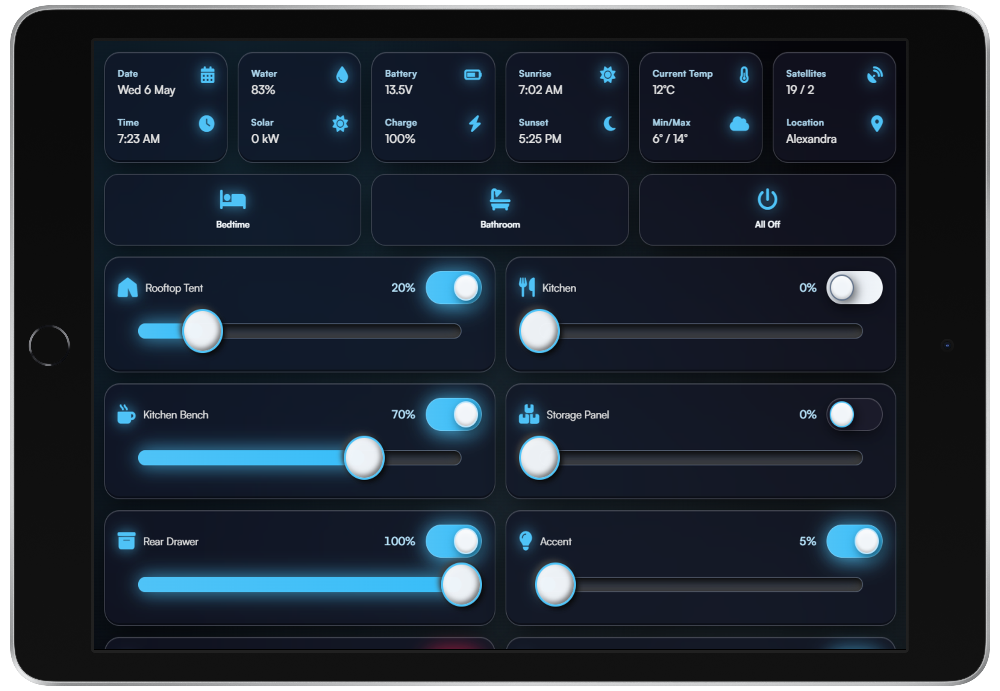
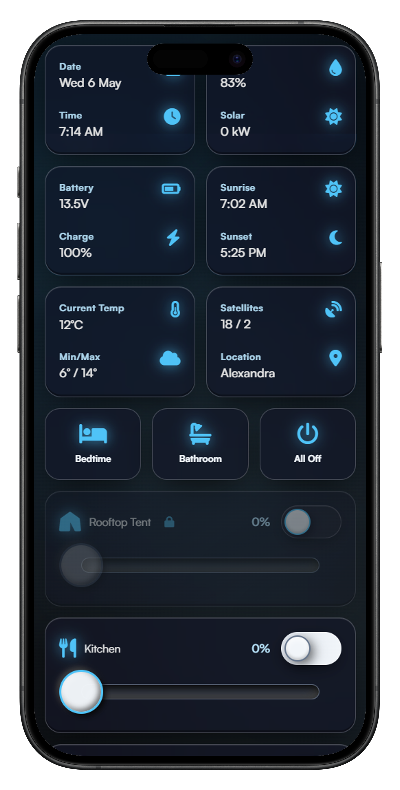
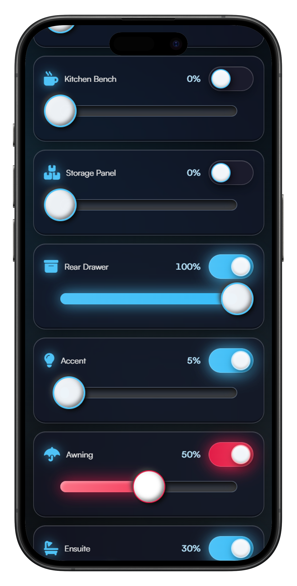

# The Pissmole Camper Control System

## Overview
The Pissmole Camping Control System (PCCS) is a Raspberry Pi-based control system for managing RV/camper trailer lighting and environmental data. It provides:
- Control of dimmable lighting and on/off relays
- Swapping between white and red (anti-bug) modes for kitchen and awning lights
- Lighting scenes such as bedtime, bathroom and all off
- Time-of-day phase calculation (day, evening and night) and accurate sunset/sunrise times based on GPS derived co-ordinates
- Reed switch monitoring of panel doors that switch on linked lights to levels based on time-of-day/phase
- Ambient lighting such as accent and awning that turn on whenever any panel is open
- Protection against turning on the rooftop tent lights when closed where the LED strip may be pressed against bedding
- Comprehensive logging that shows what light turned on and what activated it (phase change, scene, reed, user interface etc.)
- A flexible & scalable UI that can be accessed from any device including touchscreens, tablets and phones
- Full support for Cloudflare Tunnels for if the Internet connection is behind cgnat (e.g. Starlink, hotspots)
- A toast/message popup system with helpful information when events happen like GPS fix acquired/lost and phase changes
- Modern UI themes with light/dark modes including Glassmorphism/Frosted Glass, Neumorphism, Deep Minimal/Stealth and automatic toggling of light and dark modes in the evening and morning
- A diagnostics and settings page with extensive override controls and additional information

The PCCS measures and displays environmental data including:
- GPS derived data & time and sunset/sunrise times based on current coordinates
- Water tank level
- Solar generation
- Battery voltage and State of Charge
- Current temperature and daily min/max weather forecasts for the current location
- GPS satellite/quality fix and scraping of closest suburb based on current co-ordinates with offline/no internet fallback for greater North-East Victoria in Australia

The PCCS provides a better glamping experience when installed alongside other RPI packages:
- Network address translation (NAT) and DHCP via DNSMASQ. Upstream internet can be provided by USB tethering, 5G modem or Starlink
- UniFi controller for UniFi WAPs
- Pi-hole for adblocking

## Hardware
**Backend**

This project has been built with support for:
- Raspberry Pi
- Arduino Mega 2560 and IRLZ234N mosfets to ramp LEDs and the analog inputs for measuring battery voltage, solar generation and water tank level
- Adafruit Ultimate GPS Breakout PA1616S
- 4 channel 5VDC relay module
- DS18B20 1-wire Temperature Sensor
- fuel level sensor that scales from 240ohm (full) to 33ohm (empty)
- 0-25VDC Voltage divider

**Frontend**

 A touchscreen such as a waveshare powered by another RPI or Rock Pi for more capability in handling the intensive graphics processing.

## User Interface - Glassmorphism Theme (Default)
#### Desktop/Touchscreen UI


 #### Mobile UI
 

## Wiring
#### Raspberry Pi
| Logical/BCM Pin | Physical Pin | Channel Type           | Description                               |
|:---------------:|:------------:|:-----------------------|:------------------------------------------|
| 4               | 7            | 1-Wire Input           | DS18B20 Temperature Sensor                |
| 8               | 12           | UART TX                | GPS Transmit                              |
| 10              | 8            | UART RX                | GPS Receive                               |
| 17              | 10           | Relay Module Channel 1 | Floodlights                               |
| 18              | 12           | Relay Module Channel 2 | Future Water Circuit (Not in Use)         |
| 22              | 13           | Relay Module Channel 3 | Future Lighting Circuit (Not in Use)      |
| 27              | 15           | Relay Module Channel 4 | Future Fridge & Oven Circuit (Not in Use) |
| 12              | 12           | Reed Input             | Kitchen Bench                             |
| 23              | 16           | Reed Input             | Kitchen Panel                             |
| 24              | 18           | Reed Input             | Storage Panel                             |
| 25              | 22           | Reed Input             | Rear Drawer                               |
| 26              | 37           | Reed Input             | Rooftop Tent                              |
| N/A             | N/A          | USB Port               | Arduino Mega                              |

**Notes**
<small>
- Serial port for GPS communications needs to be enabled in raspi-config
- 5V for peripherals (GPS/relay module etc.) not included in above table
</small>

#### Arduino Mega
**Outputs**
 Pin | Channel Type           | Description                            |
:---:|:-----------------------|:---------------------------------------|
| 2  | PWM/Output             | Kitchen Panel RGBW LED Strip - White   |
| 3  | PWM/Output             | Kitchen Panel RGBW LED Strip - Red     |
| 4  | PWM/Output             | Kitchen Panel RGBW LED Strip - Green   |
| 5  | PWM/Output             | Kitchen Bench LED Strip                |
| 6  | PWM/Output             | Storage Panel LED Strip and Downlights |
| 7  | PWM/Output             | Rear drawer LED Strip                  |
| 8  | PWM/Output             | Accent LED Strips                      |
| 9  | PWM/Output             | Awning RGBW LED Strip - White          |
| 10 | PWM/Output             | Awning RGBW LED Strip - Red            |
| 11 | PWM/Output             | Awning RGBW LED Strip - Green          |
| 12 | PWM/Output             | Rooftop tent LED Strip                 |
| 13 | PWM/Output             | Ensuite tent LED Strip                 |

**Inputs**
 Pin | Channel Type           | Description                            |
:---:|:-----------------------|:---------------------------------------|
| A0 | Analog Input           | Battery Voltage Divider Input          |
| A1 | Analog Input           | Water Level Sensor Input               |
| A2 | Analog Input           | Solar Current Transformer Input        |

**Notes**
<small>
- Arduino Mega is used as RPI PWM/I2C servo driver expansion boards don't have enough power to drive the MOSFETs
- Breadboard circuitboard for MOSFETs and outgoing lighting circuit connections is required
- Breadboard circuitboard for voltage injection of analog sensor inputs is also required
- Blue channels of RGB lights not used in this project due to Arduino channel capacity (Green is used to soften the red)
</small>

### Other Recommended Hardware
- 12-48v PoE 5 port network switch for WAP, a wired connection to RPI and a wired connection to other lighting control touchscreens in the installation (e.g. kitchen, rooftop tent)
- Cel-Fi GO 4/5G booster

## Software Installation & Configuration
These instructions are based on the following settings:
```
Hostname: control-pi
Username: pi
Installation folder: /home/pi/pccs (or just ~pccs)
RPI IP: 10.10.10.1
DHCP range: 10.10.10.50-10.10.10.200
Internet connection: USB hotspot or WiFi (for when system is in the workshop)
```

1.  Format an SD card with Debian Trixie 64-bit. Enable SSH during installation and edit all customisation options to suit.
2.  Navigate to and open /boot/firmware/config.txt on the host computer before ejecting the SD card.
3.  Add the following lines to the end of the file to enable GPS communication:

```
enable_uart=1
dtoverlay=disable-bt
dtparam=spi=on
```

4.  Save and eject card, install into RPI and login via SSH using the account name and password set during image creation e.g. `ssh pi@192.168.0.78`.

5.  Set a static IP address for the wired ethernet port, modify details to suit:
```
sudo nmcli connection modify "netplan-eth0" ipv4.addresses 10.10.10.1/24
sudo nmcli connection modify "netplan-eth0" ipv4.dns "1.1.1.1,1.0.0.1"
sudo nmcli connection modify "netplan-eth0" ipv4.method manual
sudo nmcli connection modify "netplan-eth0" connection.autoconnect yes
```
Reset connection for changes to take effect:
```
sudo nmcli connection down "netplan-eth0"
sudo nmcli connection up "netplan-eth0"
nmcli connection show "netplan-eth0"
```
The above assumes that the ethernet name is `netplan-eth0`, run `nmcli connection show` to confirm.

---
6.   Install dependencies:
```
sudo apt update && sudo apt upgrade -y
sudo apt install nginx samba samba-common-bin python3-lgpio git usbmuxd libimobiledevice-utils ipheth-utils -y
```

---
7.  Create project folder, navigate to it and setup permissions for pi and nginx:
```
cd ~
mkdir pccs

cd pccs
sudo chown -R pi:www-data /home/pi/pccs
sudo chmod -R 775 /home/pi/pccs
sudo find /home/pi/pccs -type d -exec chmod g+s {} \;
```

---
8.  **(Optional)** - Enable file sharing for ease of editing:

Edit the config file:
```
sudo nano /etc/samba/smb.conf
```
Paste at the bottom of the file:
```
[pccs]
    path = /home/pi/pccs
    writable = yes
    browsable = yes
    public = no
    valid users = pi
    force group = www-data
    create mask = 0664
    force create mode = 0664
    directory mask = 0775
    force directory mode = 0775
    hide dot files = no
```
Press Ctrl+S to save and then Ctrl+x to exit.
Set the password for the share:
```
sudo smbpasswd -a pi
```
Restart samba for changes to take effect:
```
sudo systemctl restart smbd nmbd
```
Access the share via the IP set in the network configuration earlier in this guide. Use username `pi` and the password set just now to browse the shares.

---
9.  Configure nginx:
```
sudo nano /etc/nginx/sites-available/pccs
```
Paste the configuration:
```
server {
    listen 80;
    server_name _;

    root /home/pi/pccs;

    location / {
        proxy_pass http://127.0.0.1:5000;
        proxy_http_version 1.1;
        proxy_set_header Upgrade $http_upgrade;
        proxy_set_header Connection "upgrade";
        proxy_set_header Host $host;
        proxy_set_header X-Real-IP $remote_addr;
        proxy_set_header X-Forwarded-For $proxy_add_x_forwarded_for;
        proxy_set_header X-Forwarded-Proto $scheme;
        proxy_read_timeout 86400;
        proxy_send_timeout 86400;
        proxy_buffering off;
    }

    location /static/ {
        alias /home/pi/pccs/static/;
        expires 30d;
        add_header Cache-Control "public";
        try_files $uri =404;
    }
}
```
Press Ctrl+S to save and then Ctrl+x to exit.

Create a symlink, remove the default site config and restart nginx for changes to take effect:
```
sudo ln -s /etc/nginx/sites-available/pccs /etc/nginx/sites-enabled/
sudo rm -f /etc/nginx/sites-enabled/default
sudo nginx -t
sudo systemctl restart nginx
```

---
10. Install Git, clone the project, install the virtual environment (venv) and install more dependencies:
```
cd ~
git clone git@github.com:muntedpissmole/PCCS.git pccs

cd pccs
python3 -m venv --system-site-packages venv
source venv/bin/activate
pip install -r requirements.txt
```

Configure GPS communications:
```
sudo nano /boot/firmware/cmdline.txt
```
Search for and remove these lines: `console=serial0,115200` or `console=ttyAMA0,115200`.
Press Ctrl+S to save and then Ctrl+x to exit.

Configure GPS port permissions:
```
sudo usermod -a -G tty,dialout pi
sudo chown root:tty /dev/ttyAMA0
sudo chmod 660 /dev/ttyAMA0
```

Setup communication for the temperature sensor:
```
sudo raspi-config
```
Go to `Interface Options` → `Enable 1-Wire` → `Finish` and then reboot.
Wait for reboot then SSH back in.

---
11. Install Arduino compiler and push sketch to Arduino:

Add Arduino compiler repo:
```
curl -fsSL https://raw.githubusercontent.com/arduino/arduino-cli/master/install.sh | BINDIR=/usr/local/bin sudo sh
```
Install the compiler and push the sketch (Arduino must be connected and powered on):
```
cd ~/pccs
arduino-cli core install arduino:avr
arduino-cli compile --fqbn arduino:avr:mega --upload --port /dev/ttyACM0 arduino/
```

---
12. **(THIS FEATURE IS NOT IMPLEMENTED YET)** Enable passwordless SSH on other touchscreens for remote shutdown and turning the screen on and off with a reed switch (e.g. kitchen, rooftop tent). Replace IP addresses as needed:
```
ssh-keygen -t rsa -b 4096 -f /home/pi/.ssh/id_rsa_shutdown -N ""
ssh-copy-id -i /home/pi/.ssh/id_rsa_shutdown.pub pi@10.10.10.10
ssh-copy-id -i /home/pi/.ssh/id_rsa_shutdown.pub pi@10.10.10.11
```

---
13. Do another permissions refresh to eliminate any lingering access issues:
```
cd ~/pccs
sudo chown -R pi:www-data .
sudo chmod -R 775 .
sudo find . -type d -exec chmod g+s {} \;
sudo find . -type f -exec chmod 664 {} \;
```

---
14. Install the PCCS as a service and start it on RPI startup:
```
sudo nano /home/pi/pccs.service
```
Paste the configuration:
```
[Unit]
Description=The Pissmole Camper Control System
After=network.target nginx.service

[Service]
User=pi
Group=www-data
WorkingDirectory=/home/pi/pccs
ExecStart=/home/pi/pccs/venv/bin/python3 /home/pi/pccs/app.py
Restart=always
RestartSec=5
StandardOutput=journal
StandardError=journal
Environment=PYTHONUNBUFFERED=1
LimitNOFILE=65535

[Install]
WantedBy=multi-user.target
```
Press Ctrl+S to save and then Ctrl+x to exit.
Reload the systemctl, enable and autostart the PCCS:
```
sudo systemctl daemon-reload
sudo systemctl enable pccs.service
sudo systemctl start pccs.service
sudo systemctl status pccs.service
```

Check the status with:
```
sudo systemctl status pccs
```
To make sure it started without any errors. View the live logs with:
```
journalctl -u pccs.service -f
```
Access the UI via the IP address e.g. `http://10.10.10.1` or via the cloudflare tunnel once configured. Access the diagnostics page via `/diag` e.g. `http://10.10.10.1/diag`.

Access the log files at `\\10.10.10.1\pccs\log`.

### Updating the PCCS
1.  SSH into the Pi and git pull the newest version:
```
cd ~/pccs
git pull
```

Update the Pi OS at the same time:
```
sudo apt update && sudo apt install -y
```

Reboot if asked, otherwise restart the PCCS service:
```
sudo systemctl restart pccs
```

### Run Application Manually

Stop the service (if installed/running):
```
sudo systemctl stop pccs.service
```
Navigate to project folder, start a virtual environment and the PCCS:
:
```
cd ~/pccs
source venv/bin/activate
python app.py
```

## Other Setup:
### NAT/Routing/Internet
1. Edit the DHCP config file:
```
sudo nano /etc/dhcpcd.conf
```
Paste at the bottom:
```
# LAN - Wired clients
interface eth0
static ip_address=10.10.10.1/24
nohook wpa_supplicant

# USB tethering/hotspot
interface usb0
metric 50

# WiFi
interface wlan0
metric 200
```
Press Ctrl+S to save and then Ctrl+x to exit.

2.  Edit the DNS config file:
```
sudo nano /etc/dnsmasq.conf
```
Search for, uncomment and update the following lines or just paste everything at the end of the file:
```
interface=eth0
bind-interfaces
except-interface=wlan0
except-interface=usb0

dhcp-range=10.10.10.50,10.10.10.200,255.255.255.0,12h

dhcp-option=3,10.10.10.1
dhcp-option=6,10.10.10.1
```
Press Ctrl+S to save and then Ctrl+x to exit.


3.  Enable IP forwarding. Edit the sysctl config file:
```
sudo nano /etc/sysctl.conf
```
Uncomment this line or add it to the bottom of the file:
```
net.ipv4.ip_forward=1
```
Press Ctrl+S to save and then Ctrl+x to exit.

Apply the updated config:
```
sudo sysctl -p
```

Setup and configure NAT forwarding rules:
```
sudo iptables -t nat -A POSTROUTING -o usb0 -j MASQUERADE
sudo iptables -t nat -A POSTROUTING -o wlan0 -j MASQUERADE

sudo iptables -A FORWARD -i eth0 -o usb0 -j ACCEPT
sudo iptables -A FORWARD -i eth0 -o wlan0 -j ACCEPT
sudo iptables -A FORWARD -i usb0 -o eth0 -m state --state RELATED,ESTABLISHED -j ACCEPT
sudo iptables -A FORWARD -i wlan0 -o eth0 -m state --state RELATED,ESTABLISHED -j ACCEPT
```

Write the rules permanently the the network configuration:
```
sudo netfilter-persistent save
```

Restart everything:
```
sudo systemctl restart dhcpcd
sudo systemctl restart dnsmasq
sudo systemctl enable dnsmasq
```

Reboot the RPI with `sudo reboot` and login again after it's rebooted.
Check interface configuration looks correct:
```
ip addr show
ip route show
```

Make sure DHCP is only listening on the wired network card:
```
sudo ss -tulnnp | grep dnsmasq
```

See if the internet works:
```
ping -c 8.8.8.8
```

### UniFi Controller
1.  Add the UniFi repo:
```
echo 'deb [arch=amd64,arm64 signed-by=/usr/share/keyrings/ubiquiti-archive-keyring.gpg] https://www.ui.com/downloads/unifi/debian stable ubiquiti' | \
sudo tee /etc/apt/sources.list.d/100-ubnt-unifi.list > /dev/null

curl https://dl.ui.com/unifi/unifi-repo.gpg | \
sudo tee /usr/share/keyrings/ubiquiti-archive-keyring.gpg > /dev/null
```

2.  Install the UniFi controller:
```
sudo apt update
sudo apt install unifi -y
```

3.  Start the service and confirm that it's running:
```
sudo systemctl enable --now unifi
sudo systemctl status unifi
```

Access the UI on `https://10.10.10.1:8443`.
