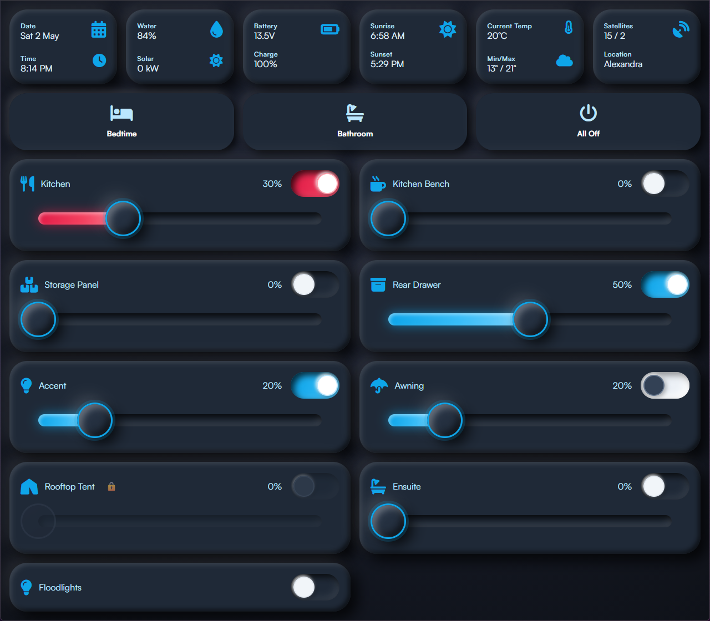
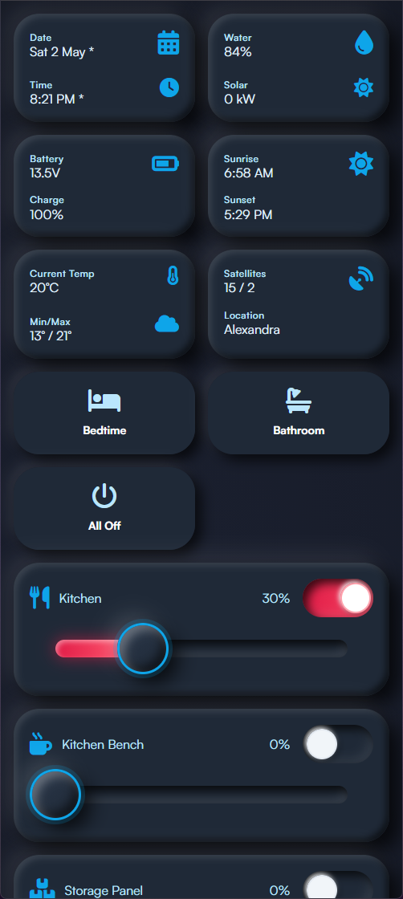

# The Pissmole Camper Control System

## Overview
The Pissmole Camping Control System (PCCS) is a Raspberry Pi-based control system for managing RV/camper trailer lighting and environmental data. It provides a user-friendly interface featuring:
- Control of dimmable lighting and on/off relays
- Swapping between white and red (anti-bug) modes for support channels
- Lighting scenes such as bedtime, bathroom and all off
- Time-of-day phase calculation (day, evening and night) and sunset/sunrise times based on GPS derived co-ordinates
- Reed switch monitoring of panel doors that trigger linked lighting to levels based on time-of-day/phase
- Ambient lighting such as accent and awning that turn on whenever a reed switch is active
- Protection against turning on lights when panels are closed such as a rooftop tent where the LED strip may be pressed against flammable bedding when the tent is closed
- Comprehensive logging that shows what light turned on, why (e.g. phase change) and what activated it (e.g. scene, reed, user interface)

The PCCS also measures and displays environmental data including:
- GPS derived data & time and sunset/sunrise times based on your coordinates
- Water tank level
- Solar generation
- Battery voltage and State of Charge
- Current temperature and daily min/max weather forecasts for your location
- GPS satellite and quality fix and sclosest suburb based on co-ordinates

All of this is available from a flexible & scalable UI that can be accessed from any device on your network including touchscreens, tablets and phones.

## Hardware
**Backend**

This project has been built with support for:
- Raspberry Pi
- Arduino Mega 2560 and IRLZ234N mosfets to ramp LEDs and the analog inputs for measuring battery voltage, solar generation and water tank level
- Adafruit Ultimate GPS Breakout PA1616S
- 4 channel 5VDC relay module
- DS18B20 1-wire Temperature Sensor
- fuel level sensor that scales from 240ohm (full) to 33ohm (empty)
- 0-25VDC Voltage divider

**Frontend**

 A touchscreen such as a waveshare powered by another RPI or Rock Pi for more capability in handling the intensive graphics processing.

 
